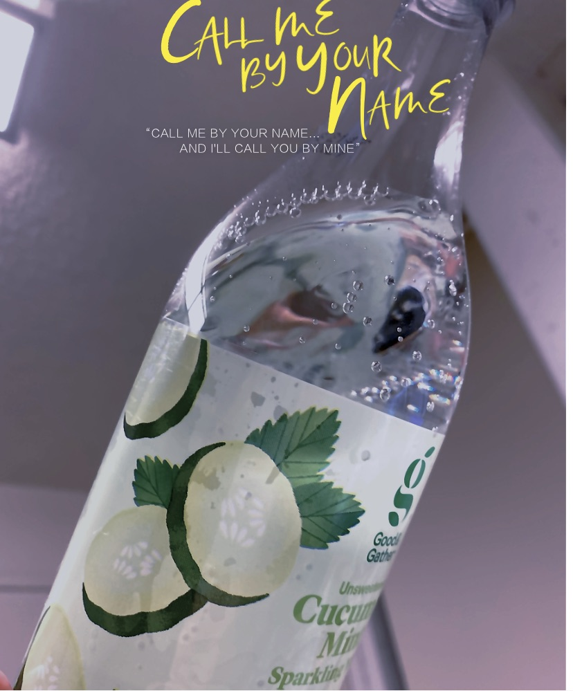

## Hello World!
## Hello World!
# Coding CSE15L

**Hello World!**
*Insert*

> Hello World

1. Week 1
2. Week 2
3. Week 3

- Question 1
- Question 2

`code`

---

[YouTube](https://www.youtube.com/)

*Today is a super hot day!!*

[Lab Report 1](https://github.com/BellaL6/cse15l-lab-reports/blob/main/lab-report-1.md)

[Lab Report 2](https://github.com/BellaL6/cse15l-lab-reports/blob/main/lab-report-2.md)

[Lab Report 3 - Week 6](https://github.com/BellaL6/cse15l-lab-reports/blob/main/lab-report-3-week-6.md)
