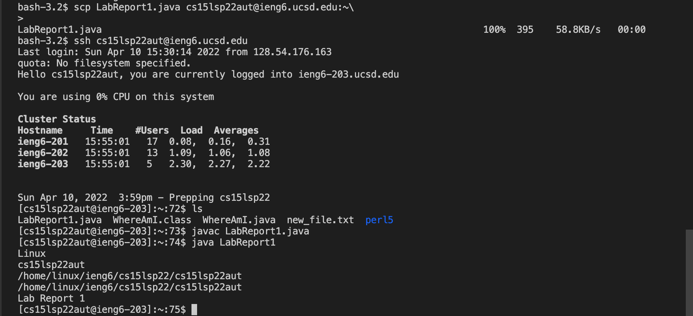
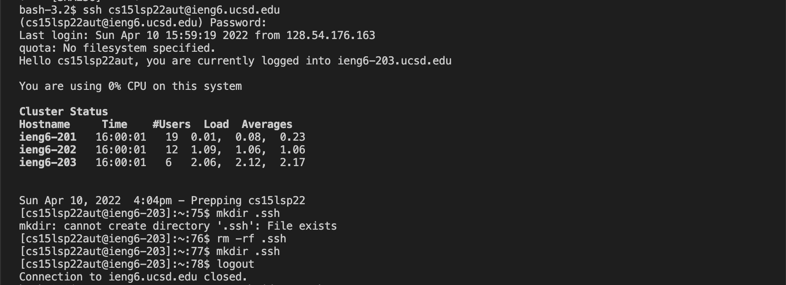
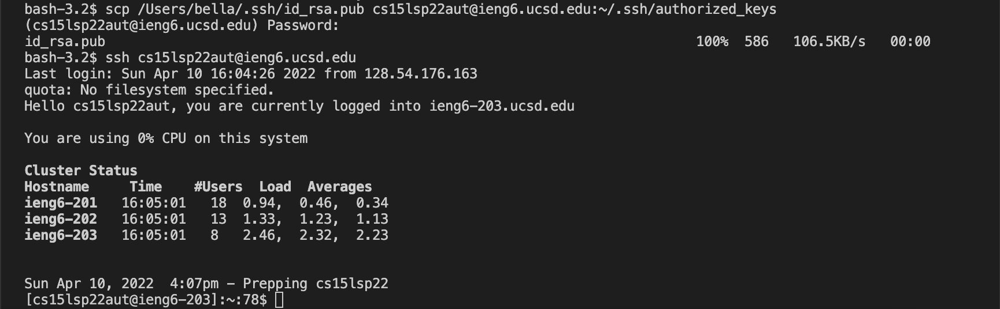
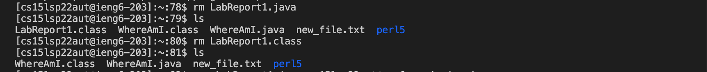

# Lab-Report-1

### * Installing VScode
* download VScode through [VScode](https://code.visualstudio.com/) according to your devices
* click on the arrow beside `Download Mac Universal` for specific mode: 
* 
* after you installed and open it, your screen should look life:
*  


### * Remotely Connecting
* open the new Terminal (recommend to switch to `bash`)
* type in `ssh cs15lsp22zz@ieng6.ucsd.edu`
* you need to replace `zz` with your course-specific account, to look at your account name, you can find it at [course-specific account](https://sdacs.ucsd.edu/%7Eicc/index.php) 
* you can also reset your password through this link
* after login to your account with the correct password, your terminal will be like this:

* if you are a first-time usr, you may see this message:
<br>`The authenticity of host 'ieng6.ucsd.edu (128.54.70.227)' can't` <br>
<br>`be established.` <br>
<br>`RSA key fingerprint is` <br>
<br>`SHA256:ksruYwhnYH+sySHnHAtLUHngrPEyZTDl/1x99wUQcec.` <br>
<br>`Are you sure you want to continue connecting` <br>
<br>`(yes/no/[fingerprint])?`<br>
* say `yes` and you can go to the page which shown above. 


### * Trying Some Commands
* now you can try some commands:
* `cd <directory>`: change direction 
* `ls -[]`: list files
* `pwd`: print working directory
* `rm`: remove
* There are more commands we can try! In the picture, I tried `ls -a` and `ls -lat`
* 
* These two commands can both list files included public and hidden, but the way of sorting those files were different.  


### * Moving Files with `scp`
* You can logout the account by typing `exit` or pressing `control-D`
* Then create a java file named anything you want, remember the file name should be `<filename>.java`
* Inside the file, you can type anything you want. In my file, I have:

```
public class LabReport1 {
    public static void main(String[] args) {
        System.out.println(System.getProperty("os.name"));
        System.out.println(System.getProperty("user.name"));
        System.out.println(System.getProperty("user.home"));
        System.out.println(System.getProperty("user.dir"));
        System.out.println("Lab Report 1");
    }
}
```
* After finishing edit the file, you now can move this file to the remote server with using `scp`
* In the terminal, type `scp <filename>.java cs15lsp22zz@ieng6.ucsd.edu:~/`
* enter your password, and then login to your account
* within your account, type `javac <filename>.java` and `java <filename>` to view your output of your file, it should be like this:



### * Setting an SSH Key
* logout your account
* in your terminal, you are going to seeting an SSH key so that for the rest of time you can login to your account directly without typing the password! Steps are:
* `ssh-keygen`
* `Enter file in which to save the key (/Users/<username>/.ssh/id_rsa): /Users/<username>/.ssh/id_rsa` (copy & paste the thing inside the () on the left-hand side)
* For the _passphrase_, **DO NOT type in anything**, press the `Enter` or `Return` instead
* after finishing these steps, your terminal should show life this: 


* NOW, login to your account using `ssh cs15lsp22zz@ieng6.ucsd.edu`
* _enter_ your password
* inside your account, type `mkdir .ssh`
* for some cases, you may have created the directory `.ssh`, so you need to remove it first by using `rm -rf .ssh`
* after that, you can use `mkdir .ssh` now
* logout 
* this whole detail was shown in the image below, included how to remove `.ssh`:


* typing `scp /Users/<username>/.ssh/id_rsa.pub cs15lsp22zz@ieng6.ucsd.edu:~/.ssh/authorized_keys`
* enter your password
* login in to your account with `ssh cs15lsp22zz@ieng6.ucsd.edu`
* now, you should login to it without typing password, details are shown in image:



### * Optimizing Remote Running
* make some changes in your `<filename>.java` in your **local computer**
* Because we have move the first draft of `<filename>.java` to the remote server before (you can using `ls` to check it)
* we may want to remove it first by using `rm <filename>.java` and `rm <filename>.class`, details shown below:
* 
* logout
* for Optimizing Remote Running, we can use **up arrow** to locate the command `scp <filename>@java cs15lsp22zz@ieng6.ucsd.edu:~/`, which we have typed it in previous step
* using **up arrow** again to locate `ssh cs15lsp22zz@ieng6.ucsd.edu` without typing
* inside the remote server, still using the **up arrow** to locate `javac <filename>.java` and `java <filename>`
* you can see new output after your edit now!  


* As we can see most of steps here were completed by using **up arrow**, which can help save more time on typing in some long code. However, the **up arrow** was useful only if you have used the same code in previous steps, you can locate them back to the recent command line. Otherwise, **up arrow** cannot locate a code which you have never used before. 
