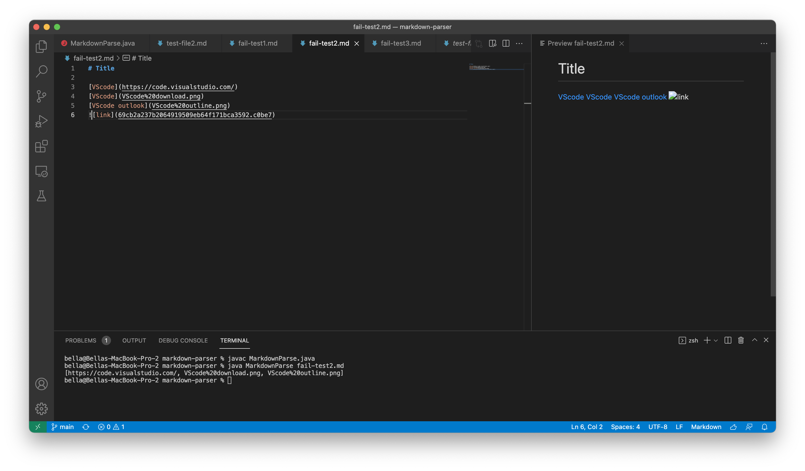

# Lab Report 2

### 1. Code change 1

* failure **_test file_ #1**: [Fail-test#1](https://github.com/BellaL6/markdown-parser/blob/main/fail-test1.md)
* failure output **#1 _screenshot_**:  
* failure output #1 **_History_**: [Fail-output-Symptom1](https://github.com/BellaL6/markdown-parser/commit/39b0e921f9115a0bb31da052a2f6f842f6f18daa?diff=unified)

* code **_Correction_ #1**: [codeCorrect1](https://github.com/BellaL6/markdown-parser/commit/93e796c86f056da9ca8591185452ccf0892df525)
* 
* **_final_ Output Screenshot 1**: 

### 2. Code change 2
* failure **_test file_ #2**: [Fail-test#2](https://github.com/BellaL6/markdown-parser/blob/main/fail-test2.md)
* failure output **#2 _screenshot_**: 
* failure output #2 **_History_**: [Fail-output-Symptom2](https://github.com/BellaL6/markdown-parser/commit/4ab65f268d9a5def542307b6f85d052c2fabc4de)

* code **_Correction_ #2**: [codeCorrect2](https://github.com/BellaL6/markdown-parser/commit/19fa94dbfc7bea7cdf45a19c1c5ddd1222ec0559)
                            
* **_final_ Output Screenshot 2**: 

### 3. Code change 3
* failure **_test file_ #3**: [Fail-test#3](https://github.com/BellaL6/markdown-parser/blob/main/fail-test3.md)
* failure output **#initial _screenshot_**: 
* failure output **#initial _History_**: [Fail-output-Symptom-initial](https://github.com/BellaL6/markdown-parser/commit/3783845586368d46ce205580dc1a317f41eba7f1)

* failure output **#3.1 _screenshot_**:
* failure output **#3.1 _History_**: [Fail-ouput-Symptom3.1](https://github.com/BellaL6/markdown-parser/commit/d809a7bb5c185cb2f291afa9bcf4fcc95b84daad)
                                     

* code **_Correction_ #3**:[codeCorrect3](https://github.com/BellaL6/markdown-parser/commit/2d49b0babba2377af6c70d79170bffadfd3715a3)
                           
* **_final_ Output 3**: 

### 4. Relationship between the bug, the symptom, and the failure-inducing input: 

