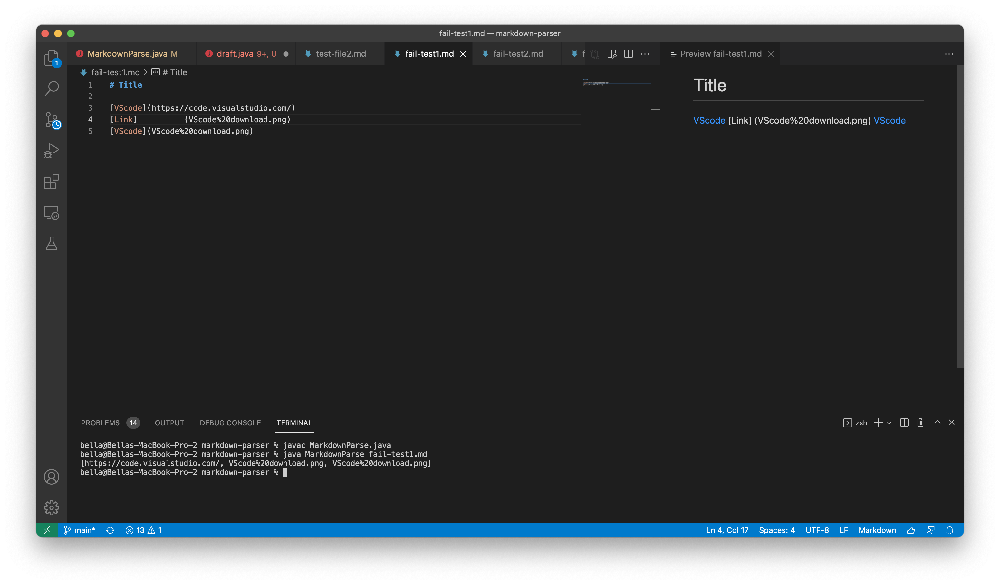

# Lab Report 2

### 1. Code change 1

* failure **_test file_ #1**: [Fail-test#1](https://github.com/BellaL6/markdown-parser/blob/main/fail-test1.md)
* failure output **#1 _symptom screenshot_**:  
_From the `Preview` of fail-test1, we noticed that only the **first** and **third** are valid link and can transfer to the 'link' format. The **second** one was invalid since the `name` and `link` are far from each other, and we can see them in the `preview`, they didn't transfer to a `link` format. However, in the output we can see, **all** three links were print out, which is incorrect and we need to update the code so that the **output meets the expected outcome** as shown on `Preview`._
* failure output #1 **_symptom History_**: [Fail-output-Symptom1](https://github.com/BellaL6/markdown-parser/commit/39b0e921f9115a0bb31da052a2f6f842f6f18daa?diff=unified)

* code change **_Correction_ #1**: [codeCorrect1](https://github.com/BellaL6/markdown-parser/commit/93e796c86f056da9ca8591185452ccf0892df525)
* code change **History 1**: 
* **_final_ Output Screenshot 1**: 
_Now the output was updated and correct since it only contains valid links._


### 2. Code change 2
* failure **_test file_ #2**: [Fail-test#2](https://github.com/BellaL6/markdown-parser/blob/main/fail-test2.md)
* failure output **#2 _symptom screenshot_**: 
_From the `Preview` of fail-test2, we noticed that the link with **image** preference should shown in an `image` format rather than a `link` format, and the rest of **three links are valid** to tranfer to `link` format. However, the output in the command line shows **all** four links, which is incorrect. We need to change the code so that it won't contain the `link` for **image**._
* failure output #2 **_symptom History_**: [Fail-output-Symptom2](https://github.com/BellaL6/markdown-parser/commit/4ab65f268d9a5def542307b6f85d052c2fabc4de)

* code change **_Correction_ #2**: [codeCorrect2](https://github.com/BellaL6/markdown-parser/commit/19fa94dbfc7bea7cdf45a19c1c5ddd1222ec0559)
* code change **History 2**: 
* **_final_ Output Screenshot 2**: 
_Now the output is correct because it contains all **valid links** and excludes the `link` with **image** reference._ 


### 3. Code change 3
* failure **_test file_ #3**: [Fail-test#3](https://github.com/BellaL6/markdown-parser/blob/main/fail-test3.md)
* failure output **#initial _symptom screenshot_**:  
_the `Preview` only contains the last openBracket, which the first `link` with `null` name will not be printed out. But when we run this file in the command line, it doesn't return an output for a long period, which shown above. After waiting for a long period, it returned an error message shown below:_

```
bella@Bellas-MacBook-Pro-2 markdown-parser % javac MarkdownParse.java
bella@Bellas-MacBook-Pro-2 markdown-parser % java MarkdownParse fail-test3.md
Exception in thread "main" java.lang.OutOfMemoryError: Java heap space
        at java.base/java.lang.StringLatin1.newString(StringLatin1.java:769)
        at java.base/java.lang.String.substring(String.java:2709)
        at MarkdownParse.getLinks(MarkdownParse.java:19)
        at MarkdownParse.main(MarkdownParse.java:30)

```

_Therefore, we need to improve the code so that it **won't take a long time** to return the output (either error message and others). Moreover, we want the returned output **matches to the expected outcome**, which contains **none of `link`**._
* failure output **#initial _symptom History_**: [Fail-output-Symptom-initial](https://github.com/BellaL6/markdown-parser/commit/3783845586368d46ce205580dc1a317f41eba7f1)

* code change 3.1: 
* failure output **#3.1 _symptom screenshot_**:
_this code change did help me fix the runtime, now I can get an output fast. However, this output doesn't match to the expected output shown in `Preview`, which we want the actual output contains **none of link**. The recent actual output contains the `link` that has a `null` name and was an **invalid link**. I still need to change my code until **reaching the expected outcome**._
* failure output **#3.1 _symptom History_**: [Fail-ouput-Symptom3.1](https://github.com/BellaL6/markdown-parser/commit/d809a7bb5c185cb2f291afa9bcf4fcc95b84daad)

* code change **_Correction_ #3**:[codeCorrect3](https://github.com/BellaL6/markdown-parser/commit/2d49b0babba2377af6c70d79170bffadfd3715a3)
* code change **History 3**: 
* **_final_ Output 3**: 
_Now the runtime is fast and the actual output contains none of links, which matches to the expected outcome._


### 4. Relationship between the bug, the symptom, and the failure-inducing input: 
_Each file with `failure-inducing input` has their **specific expected output**. When we run the file with failure-inducing input to `test` whether our code can reuturn its expected output or not, it might **cause one or more** `bugs`. To know whether our code contains bugs, we can know it **from the** `symptom`. **Symptom** can be an `error message` or the `unmatched output`. According to the symptom, we can find out where the bug comes from (or, where the code stops running). Then we can fixed bugs by **changing our code** until symptoms disappear on the next code running. Based on the **disappeared failure symptom** and **disappeared bugs**, we can know when out failure-inducing input becomes the correct input._


